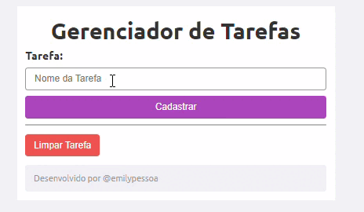

# Gerenciador de Tarefas em PHP

Este é um simples gerenciador de tarefas desenvolvido em PHP, onde você pode cadastrar e visualizar tarefas. Abaixo estão listados alguns dos recursos da linguagem PHP utilizados neste código, conforme apresentados no vídeo do canal **Monolito PHP**.

## Aplicação:

## Recursos Utilizados:

- **isset**: Função utilizada para verificar se uma variável está definida. No contexto deste código, é usado para verificar se os parâmetros GET foram passados.

- **session_start()**: Inicia uma nova sessão ou resume a sessão existente. Neste caso, é utilizado para iniciar a sessão do PHP para armazenar as tarefas do usuário.

- **$_SESSION**: Uma variável global do PHP usada para armazenar dados de sessão do usuário em todas as páginas. Aqui, é usada para manter as tarefas do usuário entre diferentes requisições.

- **foreach**: Estrutura de controle utilizada para percorrer arrays. É utilizada para iterar sobre as tarefas armazenadas na sessão e exibi-las na página.

- **array()**: Função que cria um novo array. Utilizada para inicializar o array de tarefas caso ele não exista na sessão.

- **$_GET**: Uma variável global do PHP que é usada para coletar dados enviados por meio do método GET em um formulário HTML. Neste contexto, é usado para obter o nome da tarefa submetida pelo usuário.

- **array_push()**: Adiciona um ou mais elementos no final de um array. Utilizado para adicionar novas tarefas ao array de tarefas na sessão.

- **var_dump()**: Exibe informações sobre uma ou mais variáveis. Pode ser usado para depurar e entender a estrutura das variáveis, embora não seja comum em código de produção como este.

- **unset()**: Remove uma variável especificada. Aqui, é utilizado para limpar o array de tarefas da sessão quando o usuário deseja remover todas as tarefas.

## Autor e Fonte:

Este código foi criado pelo autor do canal **Monolito PHP**. Para mais detalhes sobre como este código foi implementado, você pode assistir ao vídeo correspondente no seguinte [link](https://www.youtube.com/watch?v=dJ49I-QYYUk&ab_channel=MonolitoPHP).

## Sobre o Código:

O código PHP é responsável por gerenciar as tarefas inseridas pelo usuário. Ele verifica se a sessão está iniciada, se a tarefa foi submetida através do método GET, adiciona a tarefa à lista de tarefas na sessão e permite limpar todas as tarefas. O HTML e CSS são responsáveis pela estrutura e estilo da página web.

### Contato:
IG: emilyy.pesso
GitHub: emilypessoa
